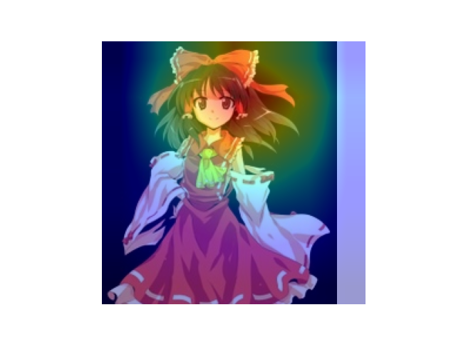
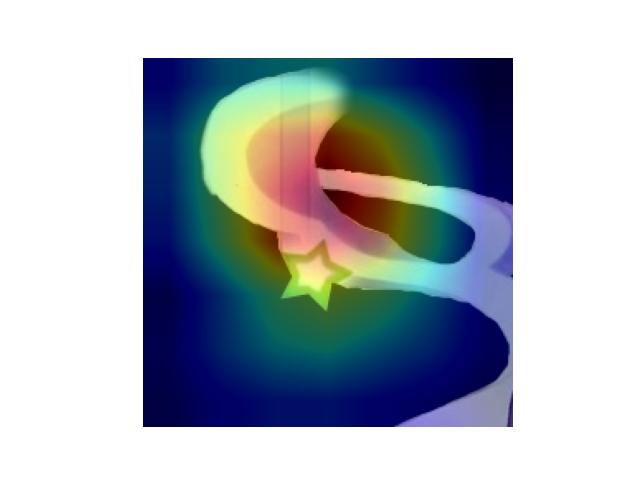
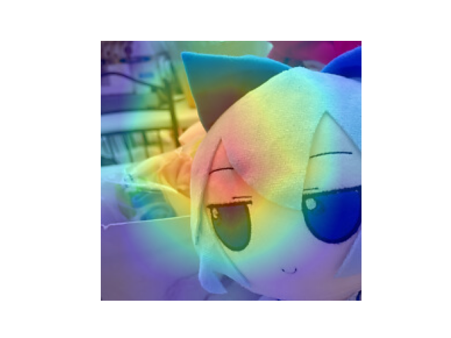

***THOUHOU VISION AI***


**Introduction**

This is a AI classfier that recognizes Hakurei Reimu(博丽灵梦), Kirisame Marisa(雾雨魔理沙), Cirno(琪露诺) (More characters will be coming up!) in Touhou Project. I built the model with Pytorch, and trained by finding dataset oniline. I also include a Grad-CAM heatmaps as the output for visual explanations of 'WHY' this character is identified.


**Installation (Using terminal)**

*1. Clone the repo*
```python
git clone https://github.com/YYDongRo/Touhou_character_classifier.git
cd Touhou_character_classifier
```

*2. Create a virtual environment*
```python
python3 -m venv .venv
source .venv/bin/activate
```

*3. Install dependencies*
```python
pip install -r requirements.txt
```

*4. Feel free to train the model yourself, but remember to place the dataset like shown below*
```python
(data/
  reimu/
  marisa/
  cirno/)
  ```

*5.  Train the model*
```pythonn
python -m src.train
```

*6. Ask it the Touhou Character that you don't know!*
```python
from src.inference import predict
print(predict("path_to_image.jpg"))
```

*7. Add Grad-CAM heatmap as your outcome*
```python
from src.gradcam import get_gradcam
import matplotlib.pyplot as plt

cam, img, label = get_gradcam("data/cirno/example.jpg/jpeg")
plt.imshow(img)
plt.imshow(cam, cmap='jet', alpha=0.4)
plt.axis("off")
plt.show()
```

*8. Neat web interface*
```python
streamlit run app.py
```

*Here are some examples of heatmap using Grad-CAM*:
**博丽灵梦**

**雾雨魔理沙**

**琪露诺**



